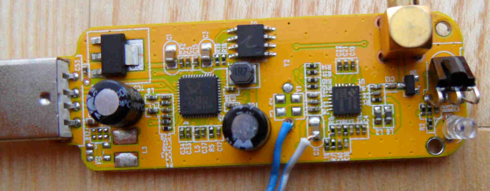

Multi-rtl
==================
Multi-rtl is a GNU Radio block that transforms cheap RTL-SDR receivers into multichannel receiver. 

Multi-rtl is the first software solution that:
* automates synchronization of multiple RTL-SDR receivers,
* enables synchronous reception with each channel tuned to a different central frequency.

Installation
==================
To install multi-rtl installation of gnuradio-dev, gr-osmosdr and python-scipy is required. Tools typically used for building GNU Radio - cmake, swig and g++ - are also needed.

On Debian based systems to install multi-rtl use following command:
```sh
sudo apt-get install gr-osmosdr gnuradio-dev cmake swig build-essential
```

You can also use [PyBombs](https://github.com/gnuradio/pybombs) to install multi-rtl. Installation of PyBombs itself is described in [here](https://github.com/gnuradio/pybombs#installation). After installing it execute:
```sh
sudo pybombs install gr-osmosdr
```

Then download multi-rtl source code:
```sh
git clone https://github.com/ptrkrysik/multi_rtl.git
```

... compile it and install:
```sh
cd multi_rtl
mkdir build
cd build
cmake ..
sudo make install
```

Preparation of RTL-SDR receivers
================================
The prerequisite to use multi-rtl is having two or more RTL-SDR devices sharing common clock source. The simplest and cheapest way to achieve that is to use the [clever hack](http://kaira.sgo.fi/2013/09/16-dual-channel-coherent-digital.html) invented by Juha Vierinen. The modification is presented on the photos below:
  

One of the dongles has replaced oscillator and takes clock reference from another one.

If you need more than three channels use solution based on external clock and clock distribution circuitry like the one descibed by [YO3IIU](http://yo3iiu.ro/blog/?p=1450).

You can also set identifiers dongles so it will be possible to distinguish channels of your multi-rtl receiver. To do this set different identifier to each dongle with use of:
```sh
rtl_eeprom -d <device_index> -s <serial_number>
```
If you connect dongles one by one (so only one is connected at a time) `device_index` is 0. `serial_number` is a unique number that you assign to your dongle acting as a channel. In the rest of the README it is assumed that consecutive numbers of the following form are used as numbers of channels: `00000001, 00000002, 00000003, ...`.

Usage
==================
Multi-rtl is a GNU Radio block. The most natural way to use it is to build a flowgraph in GNU Radio companion.

How it works in details
==================
For details what is original input of multi-rtl to previous efforts to make multichannel receiver read the author's blog post.

Author
==================
Piotr Krysik <ptrkrysik@gmail.com>

If you use the ideas from multi-rtl to implement multichannel receiver yourself please give the credit to the multi-rtl's author.
